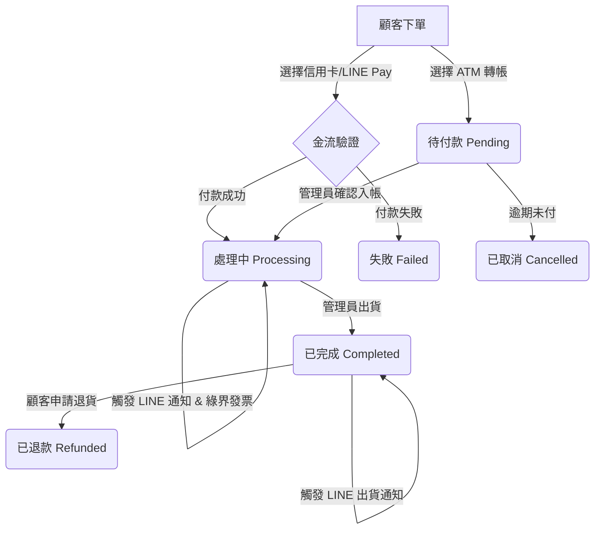

# 附錄 B：訂單狀態與郵件觸發點流程圖

嗨，歡迎來到 MoksaWP 網站營運實戰班！

這個附錄章節是一個非常重要的參考資料。我們將以「流程圖」的概念，為你完整解析一張 WooCommerce 訂單從「誕生」到「完成」的生命週期。

理解這個流程，你才能清楚知道在什麼時間點、哪個系統 (WooCommerce, FluentCRM, LINE Notify) 會自動寄送什麼通知給顧客，從而打造一個完美、自動化的顧客溝通體驗，大幅減少客服人力。

---

### 核心觀念：什麼是「訂單狀態」？

在 WooCommerce 中，**訂單狀態 (Order Status)** 是一個標籤，用來表示訂單目前處於哪個處理階段。每個狀態的改變，都可能是一個「**觸發點**」，用來啟動後續的自動化流程，例如寄送 E-mail、發送 LINE 通知、開立電子發票等。

以下是 WooCommerce 最常見的預設訂單狀態：

*   **待付款 (Pending payment):** 訂單已成立，但尚未收到款項。例如顧客選擇 ATM 轉帳，在轉帳前訂單就會是這個狀態。
*   **失敗 (Failed):** 付款失敗或被拒絕。
*   **處理中 (Processing):** **核心狀態！** 這代表「**款項已收到，商品等待出貨**」。對於實體商品，這是最重要的狀態，代表你可以開始撿貨、包貨、準備出貨了。
*   **已完成 (Completed):** 訂單已出貨，整個交易流程在網站端已結束。
*   **等待中 (On hold):** 款項已收到，但你需要手動確認某些事情（例如核對身份、等待特定商品到貨）。預設情況下，ATM 轉帳訂單在顧客付款後會先進入此狀態，等待你確認。
*   **已取消 (Cancelled):** 由管理員或顧客取消的訂單。
*   **已退款 (Refunded):** 由管理員全額或部分退款的訂單。

---

### WooCommerce 訂單生命週期與通知流程

為了方便你理解，我們將整個流程繪製成一個詳細的表格。你可以將這張表視為你網路商店後台運作的SOP藍圖。

| 觸發動作 (Trigger Action) | 訂單狀態變更 | 觸發的系統通知 (預設) | Moksa 備註與技巧 |
| :--- | :--- | :--- | :--- |
| **1. 顧客提交結帳** | `(無)` -> `待付款` | 1. **[給管理員] 新訂單通知信** 2. **[給顧客] 訂單收到確認信 (Order confirmation)** | **Moksa 技巧：** 這是 **FluentCRM** 介入的絕佳時機！可以設定自動化，將此顧客加入「潛在顧客」標籤，並啟動一個「**棄單挽回**」計時器（例如 24 小時後若狀態仍為 `待付款`，則自動寄送提醒信）。 |
| **2a. 顧客使用 綠界 ECPay 信用卡 / LINE Pay 付款成功** | `待付款` -> `處理中` | 1. **[給顧客] 訂單處理中通知信 (Your order is now being processed)** 2. **[系統] 觸發綠界電子發票開立** 3. **[系統] 觸發 Order Notify for WooCommerce (LINE 通知)** | **重要觀念：** 狀態變更為「**處理中**」，代表你**已經收到錢了**，可以準備出貨！  1. **綠界發票**：我們的設定通常是在訂單變為 `處理中` 時自動開立發票。 2. **LINE 通知**：透過 **Order Notify**，顧客會立刻在 LINE 收到「✅ 您的訂單 OOO 已付款成功，我們將盡快為您出貨」的即時訊息，大幅提升顧客安心感。 |
| **2b. 顧客使用 ATM 轉帳並回報後 你手動確認款項** | `待付款` -> `處理中` | *(同上)* | **實務操作：** 這是手動流程。你需要登入網路銀行確認款項，然後到 WooCommerce 後台將該筆訂單狀態手動從 `待付款` 或 `等待中` 更新為 `處理中`。更新後，才會觸發後續的發票和 LINE 通知。 |
| **3. 你在後台 使用 RY Tools 列印託運單並出貨** | `處理中` -> `已完成` | 1. **[給顧客] 訂單已完成通知信 (Your order is completed)** 2. **[系統] 觸發 Order Notify for WooCommerce (LINE 通知)** | **Moksa 技巧：** 這是整個流程的最後一哩路。  1. **RY Tools**：當你透過 RY Tools 產生超商或宅配的託運單號時，這個號碼會自動寫入訂單中。 2. **客製化完成信**：我們強烈建議客製化「訂單已完成」的 E-mail 範本，將 **RY Tools 產生的物流追蹤碼與連結** 自動帶入信件中，讓顧客可以一鍵查詢！ 3. **LINE 通知**：顧客會收到「🚀 您的訂單 OOO 已出貨！物流單號為 XXX」的通知，再次提升專業度與顧客體驗。 |
| **(特殊) 你操作退款** | `處理中` 或 `已完成`  -> `已退款` | 1. **[給顧客] 訂單已退款通知信 (Your order has been refunded)** 2. **[系統] 觸發綠界金流刷退 / 作廢發票** | **重要觀念：** 在 WooCommerce 後台操作退款時，系統會詢問你是否要透過原付款方式 (綠界) 進行退款。勾選後，會自動觸發金流中心的刷退或作廢流程。 |
| **(特殊) 訂單逾期未付** | `待付款` -> `已取消` | 1. **[給顧客] 訂單已取消通知信** | **Moksa 技巧：** 你可以在 `WooCommerce > 設定 > 商品 >庫存` 中設定「**保留庫存（分鐘）**」。當訂單處於 `待付款` 超過這個時間，就會自動被取消並釋出庫存。這是防止惡意佔用庫存的必備設定。 |

`[截圖]` - 顯示 WooCommerce 訂單狀態變更的下拉選單，以及右側的「訂單動作」執行按鈕。

### 流程視覺化

為了讓你更有感覺，這裡是一個簡化的文字流程圖：

### Moksa 實戰總結

1.  **自動化是核心**：一個設計良好的電商網站，從下單、付款、開發票、出貨通知，都應該是「**全自動**」或「**半自動**」的。你的主要工作應該是「**確認款項（ATM單）**」和「**包貨出貨**」。
2.  **通知建立信任**：每一次的狀態更新，伴隨著一封專業的 E-mail 或一則即時的 LINE 通知，都是在與顧客建立信任感。顧客清楚知道訂單的進度，自然就會安心，不會一直來信或私訊詢問「我的東西到哪了？」。
3.  **活用你的工具**：我們教的 **FluentCRM**、**Order Notify**、**RY Tools** 和**綠界金流/發票**，它們之間是環環相扣的。理解這個流程圖，你才能將這些工具的威力發揮到最大，打造一個真正能幫你賺錢又省時的自動化銷售機器。

請務必將此附錄保存好，當你未來在營運上遇到流程問題時，隨時可以回來查閱。